<h1 align="center">Hi 👋, I'm Asmin Dhakal</h1>

<h3 align="center">
  Software Engineer • Full-Stack Developer • DevOps Enthusiast
</h3>

  I build scalable web applications, mobile apps, APIs, and cloud-native systems.

  
  
  

---

## 👨‍💻 About Me

I'm a Software Engineer from Nepal focused on building modern, scalable, and production-ready applications.

- 🔭 Currently working as a **Full-Stack Developer**
- 💻 Experienced in **React, Next.js, Node.js, NestJS, and React Native**
- ⚙️ Building backend systems with **NestJS, .NET, PostgreSQL, Redis, and Prisma**
- ☁️ Exploring **AWS, Azure, Docker, Kubernetes, Terraform, and DevOps**
- 🤖 Working with **AI, RAG, LLM applications, vector databases, and AI agents**
- 📱 Building cross-platform mobile applications with **React Native**
- 🛠️ Interested in **system design, distributed systems, cloud infrastructure, and scalable architectures**
- 📚 Always learning and experimenting with new technologies
- 🌏 Based in **Nepal**

---

## 🚀 What I Build

### 🌐 Full-Stack Applications

I build complete applications from frontend to backend, including:

- Modern web applications
- REST APIs
- Authentication & authorization
- Admin dashboards
- E-commerce platforms
- ERP systems
- Content management systems

### 📱 Mobile Applications

Building mobile applications using:

- React Native
- Expo
- Redux
- TanStack Query
- REST APIs
- Offline/network-aware experiences

### ☁️ Cloud & DevOps

Working with:

- Docker & Docker Compose
- Kubernetes
- Minikube
- Azure
- AWS
- Terraform
- Caddy / Nginx
- CI/CD
- Argo CD
- HashiCorp Vault
- External Secrets Operator
- Prometheus & Grafana
- Loki

### 🤖 AI & Intelligent Applications

Exploring and building:

- RAG pipelines
- LLM-powered chatbots
- AI agents
- Vector search
- Semantic search
- Document-based question answering
- Product recommendation systems
- AI-powered classification
- LLM application architectures

---

# 🛠️ Tech Stack

### Frontend

  
  
  
  
  
  

**React • Next.js • TypeScript • JavaScript • Tailwind CSS • Redux • React Query**

### Backend

  
  
  
  

**Node.js • NestJS • Express • Python • REST APIs • GraphQL**

### Databases & Storage

  
  
  
  

**PostgreSQL • MongoDB • MySQL • Redis • Prisma • Drizzle ORM**

### Mobile

  
  

**React Native • Expo • React Navigation • Redux • TanStack Query**

### Cloud & DevOps

  
  
  
  
  
  
  

**AWS • Azure • Docker • Kubernetes • Terraform • Jenkins • Argo CD • Linux • Caddy • Nginx**

### Monitoring & Infrastructure

**Prometheus • Grafana • Loki • Vault • External Secrets • RabbitMQ • Redis**

### AI / Data

**OpenAI • RAG • Vector Search • Qdrant • Embeddings • LLM Applications • AI Agents**

---

# 📌 Featured Projects

## 🏢 Pashmina ERP

A business management system designed for pashmina manufacturing workflows.

**Tech:** React • TypeScript • Express • Drizzle ORM • PostgreSQL

Features include:

- Role-based access control
- Admin management
- Store management
- Supervisor workflows
- Accounts management
- Piece-rate wage management
- Inventory and operational workflows

---

<h2>
  
  Danfe Tea AI Assistant
</h2>

An AI-powered shopping assistant designed for an e-commerce tea store.

**Tech:** NestJS • PostgreSQL • Redis • Qdrant • OpenAI • RAG

Working on:

- Product-aware conversations
- RAG-based knowledge retrieval
- Semantic search
- Product recommendations
- Shopify integration
- Order and checkout tools
- Streaming responses
- AI intent classification
- Knowledge-base management

---

## 🍽️ Flavors Nepal

A food-focused social platform with video content and AI-powered processing.

**Tech:** .NET • React Native • PostgreSQL • RabbitMQ • Azure • Kubernetes • FFmpeg • AI**

Working with:

- Video upload & processing
- Async event-driven architecture
- RabbitMQ
- Azure Blob Storage
- FFmpeg transcoding
- AI food classification
- Kubernetes deployments
- Argo CD
- Vault
- External Secrets
- Prometheus / Grafana / Loki

---

## 🛒 Luna Bites

An e-commerce platform for baby food products.

**Tech:** Next.js • Vendure • Node.js • PostgreSQL • Docker**

---

## 📱 Drinks Nepal

A mobile e-commerce and delivery application.

**Tech:** React Native • Redux • REST APIs**

---

## 🥾 Trekking CMS

A content management platform for trekking and travel-related businesses.

**Tech:** Next.js • React • Node.js • PostgreSQL**

---

# 📊 GitHub Stats

<h2 align="center">📊 GitHub Stats</h2>

  

  

  

